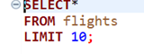
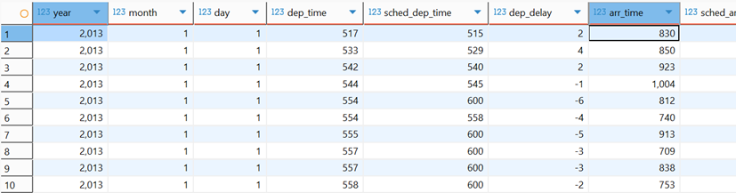
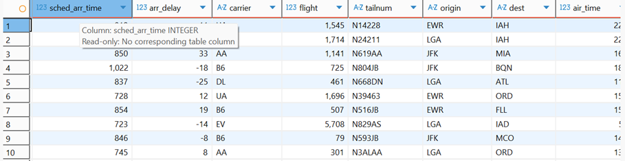
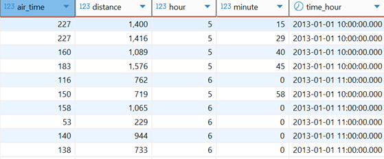
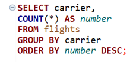
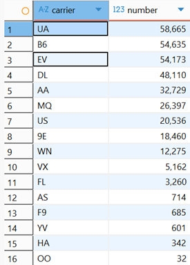
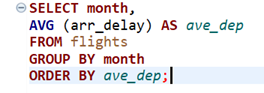
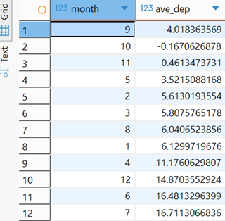
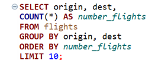
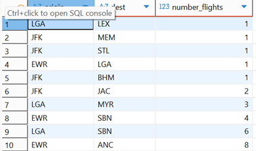

## Assignment 6 (SQL) Part 1

### Load the necessary packages

```{r}

#install.packages("DBI")
#install.packages("duckdb")


library(DBI)
library(duckdb)
library(tidyverse)

```

### 

```{r}

conn <- dbConnect(duckdb(),"../data/flights.duckdb")


```

### a. List the first 10 rows

```{r}

dbGetQuery(conn, "SELECT *
                  FROM flights
                  LIMIT 10;")


```

### b. Find the number flights

```{r}

dbGetQuery(conn, "SELECT carrier,
                  COUNT(*) AS NUMBER
                  FROM flights
                  GROUP BY carrier
                  ORDER BY number DESC;")


```

### c. Find the average departure delay

```{r}

dbGetQuery(conn, "SELECT carrier,
                  AVG (dep_delay) AS ave_dep
                  FROM flights
                  GROUP BY carrier;")
                  


```

### d. Find the top 5 destinations

```{r}

dbGetQuery(conn, "SELECT dest,
           COUNT(*) AS top_five
           FROM FLIGHTS
           GROUP BY dest
           ORDER BY top_five DESC
           LIMIT 5;")


```

### e. Table showing both the carrier along with the average arrival time

```{r}

dbGetQuery(conn, "SELECT carrier,
                  AVG(arr_delay) AS mean_arr
                  FROM flights
                  GROUP BY carrier
                  ORDER BY mean_arr DESC;") 


```

### Necessary step, disconnect

```{r}

#Once part 1 is complete, we can disconnect. 

dbDisconnect(conn)


```

## Part 2 (Running SQL using DBeaver with DuckDB)

### a. List the first 10 rows of the flights tables.

```{r}









```

### b. Count the number of flights for each carrier

```{r}






```

### c. Find the average departure by month

```{r}






```

### d. Find the top 10 routes (dest) by origin and dest

```{r}






```
